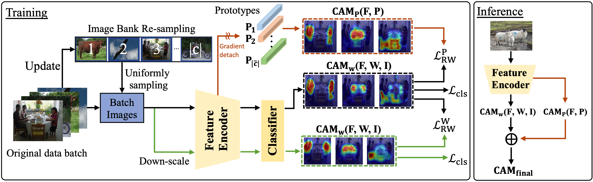

# SFC: Shared Feature Calibration in Weakly Supervised Semantic Segmentation



The implementation of [**SFC: Shared Feature Calibration in Weakly Supervised Semantic Segmentation**](https://arxiv.org/pdf/2401.11719.pdf), Xinqiao Zhao, Feilong Tang, Xiaoyang Wang, Jimin Xiao, AAAI 2024.

## Abstract
Image-level weakly supervised semantic segmentation has received increasing attention due to its low annotation cost. Existing methods mainly rely on Class Activation Mapping (CAM) to obtain pseudo labels for training semantic segmentation models. In this work, we demonstrate that the long-tailed distribution in the training set can cause the CAM calculated through the classifier weights over-activated for the head classes and under-activated for the tail classes due to the shared features among different classes. This degrades the CAM quality and further influences the final semantic segmentation performances. To address this issue, we propose a Shared Feature Calibration (SFC) method for CAM generation. Specifically, we leverage the class prototypes which carry positive shared features and propose a Multi-Scaled ROCon-Weighted (MSRW) consistency loss for narrowing the gap between the CAMs generated through the classifier weights and class prototypes during training, and further combine these CAMs during inference, thereby solving the head-class over-activation and tail-class under-activation issues. Experimental results show that our SFC can significantly improve the CAM boundaries and achieve new state-of-the-art performances. 

## Environment

- Python >= 3.6.6
- Pytorch >= 1.6.0
- Torchvision

## Usage

#### Step 1. Prepare Dataset

- PASCAL VOC 2012: [Download](http://host.robots.ox.ac.uk/pascal/VOC/voc2012/).
- MS COCO 2014: [Image](https://cocodataset.org/#home) and [Label](https://drive.google.com/file/d/1Pm_OH8an5MzZh56QKTcdlXNI3RNmZB9d/view?usp=sharing).

#### Step 2. Train SFC

```bash
# PASCAL VOC 2012
bash run_voc.sh

# MS COCO 2014
bash run_coco.sh
```

#### Step 3. Train Fully Supervised Segmentation Models

To train fully supervised segmentation models, we refer to [deeplab-pytorch](https://github.com/kazuto1011/deeplab-pytorch) and [seamv1](https://github.com/YudeWang/semantic-segmentation-codebase/tree/main/experiment/seamv1-pseudovoc).

## Citation
```
@article{zhao2024sfc,
  title={SFC: Shared Feature Calibration in Weakly Supervised Semantic Segmentation},
  author={Zhao, Xinqiao and Tang, Feilong and Wang, Xiaoyang and Xiao, Jimin},
  journal={arXiv preprint arXiv:2401.11719},
  year={2024}
}
```
